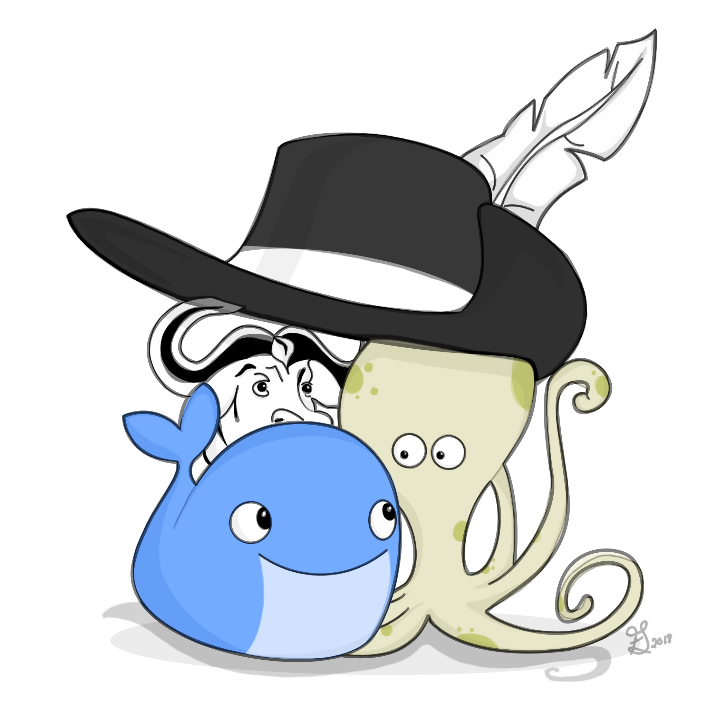
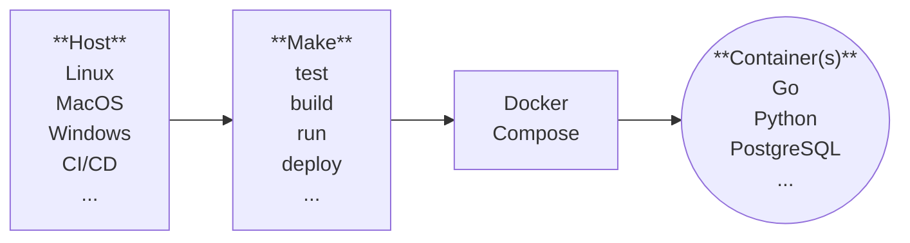
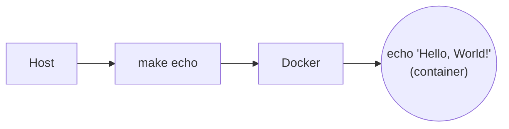

# 3 Musketeers

<div align="center">



**Test, build, and deploy your apps from anywhere, the same way!**

[![Build Status][linkGitHubActionsProjectBadge]][linkGitHubActionsProject]
[![Netlify Status][linkNetlifyProjectBadge]][linkNetlifyProject]
[![License][linkLicenseBadge]][linkLicense]

</div>

<details>
  <summary>Table of Contents</summary>

<!-- START doctoc generated TOC please keep comment here to allow auto update -->
<!-- DON'T EDIT THIS SECTION, INSTEAD RE-RUN doctoc TO UPDATE -->

- [Overview](#overview)
- [Why?](#why)
  - [Consistency](#consistency)
  - [Control](#control)
  - [Confidence](#confidence)
- [Demo](#demo)
- [Getting started](#getting-started)
  - [Prerequisites](#prerequisites)
  - [Steps](#steps)
- [3 Musketeers website development](#3-musketeers-website-development)
  - [Prerequisites](#prerequisites-1)
  - [Development](#development)
  - [Deployment](#deployment)
    - [Create a new site](#create-a-new-site)
    - [Deploy](#deploy)
    - [Delete](#delete)
  - [CI/CD](#cicd)
  - [Visual elements](#visual-elements)
- [Contributing](#contributing)
- [References](#references)
- [Stargazers over time](#stargazers-over-time)
- [License](#license)

<!-- END doctoc generated TOC please keep comment here to allow auto update -->

</details>

## Overview

<!-- Copy of docs/guide/index.md -->

The 3 Musketeers is a pattern for developing software in a repeatable and consistent manner. It leverages Make as an orchestration tool to test, build, run, and deploy applications using Docker and Docker Compose. The Make and Docker/Compose commands for each application are maintained as part of the application’s source code and are invoked in the same way whether run locally or on a CI/CD server.

<!-- Copy of diagrams/overview.mmd -->


## Why?

### Consistency

Run the same commands no matter where you are: Linux, MacOS, Windows, CI/CD tools that supports Docker like GitHub Actions, Travis CI, CircleCI, and GitLab CI.

### Control

Take control of languages, versions, and tools you need, and version source control your pipelines with your preferred VCS like GitHub and GitLab

### Confidence

Test your code and pipelines locally before your CI/CD tool runs it. Feel confident that if it works locally, it will work in your CI/CD server.

## Demo

<!-- Copy of docs/guide/index.md-->


_The demo was generated with VHS using the 3 Musketeers ([source](demo))._

## Getting started

<!-- Copy of docs/guide/getting-started.md -->

Let's print out `Hello, World!` in the terminal using the 3 Musketeers. The command `make echo` will be calling Docker to run the command `echo 'Hello, World!'` inside a container.

<!-- Copy of diagrams/getting-started.mmd -->


### Prerequisites

- [Docker](https://www.docker.com/)
- [Compose](https://docs.docker.com/compose/)
- [Make](https://www.gnu.org/software/make/)

### Hello, World!

Create the following 2 files:

```yaml
# docker-compose.yml
version: '3.8'
services:
  alpine:
    image: alpine
```

```makefile
# Makefile
echo:
	docker compose run --rm alpine echo 'Hello, World!'
```

Then simply run:

```bash
make echo
```

<br>

For more information, visit [3 Musketeers website][link3Musketeers].

## 3 Musketeers website development

This repository is the [3 Musketeers website][link3Musketeers] website built with [VitePress][linkVitePress]. This section explains how to develop, test, and deploy using the 3 Musketeers.

### Prerequisites

- [Docker](https://www.docker.com/)
- [Compose](https://docs.docker.com/compose/)
- [Make](https://www.gnu.org/software/make/)
- [Netlify](https://netlify.com) account
- [Netlify personal access token](https://app.netlify.com/user/applications)

### Development

```bash
# Create a .env file
make envfile ENVFILE=env.example
# Install dependencies
make deps

# Start vitepress server for local development
make dev
# Wait till the message 'vite v2.5.3 dev server running at' appears
# Access the website in your browser at http://localhost:8080/
# \<ctrl-c\> to stop

# Build static site
make build

# Serve static site for local development
make serveDev
# Access the website in your browser at http://localhost:8080/
# \<ctrl-c\> to stop

# Serve static website (headless)
make serve

# Test static website
make test

# Prune
make prune

# Contributing? Make sure the following command runs successfully
make all
```

### Deployment

The 3 Musketeers website is deployed to Netlify. This section shows how to create site, deploy, and delete using [Netlify CLI][linkNetlifyCLI]. This is handy for previewing new changes.

#### Create a new site

This section creates a new empty Netlify site. Ensure the `.env` file contains the access token.

```bash
# All the following commands will be run inside a container
make shell

# Disable telemetry (optional)
yarn run netlify --telemetry-disable

# Create new Netlify blank site
yarn run netlify sites:create --disable-linking
# Answer the questions regarding the team and site name
# Site name can be something like 3musketeers-preview-{random 5 digit numbers}
Site Created

Admin URL: https://app.netlify.com/sites/site-name
URL:       https://site-name.netlify.app
Site ID:   site-id

# You can always get back that information
yarn run netlify sites:list

# Copy the ID to .env

# Exit the container
exit
```

#### Deploy

This section deploys the website to an existing netlify site. Ensure the `.env` file contains the right site ID and access token.

```bash
# Build the website
make build
# Deploy to netlify
make deploy
# Test the website
curl https://site-name.netlify.app
# Clean up directory
make prune
```

#### Delete

This section deletes a netlify site. Ensure the `.env` file contains the right site ID and access token.

```bash
# All the following commands will be run inside a container
make shell
# Disable telemetry (optional)
yarn run netlify --telemetry-disable
# Delete the site (optional)
yarn run netlify sites:delete
# Exit the container
exit
```

### CI/CD

[GitHub Actions][linkGitHubActions] is used to test PRs and deploy changes made to `main` branch to Netlify.

- A dedicated Netlify personal access token has been created for Github Actions
- Environment variables required for deploying to Netlify are set as [secrets for GitHub Actions][linkGitHubActionsSecrets]
- The GitHub Actions workflows follow the 3 Musketeers pattern so it is a good real life example

### Visual elements

- 3 Musketeers logo
    - Created by me with [Procreate][linkProcreate] and [Vectornator][linkVectornator]
        - Neat tools used are [offset path][linkVectornatorOffsetPath] and [mask objects][linkVectornatorMaskObjects]
    - 2048px by 2048px SVG image
    - Images are in folder `docs/public/img`
- Favicon
    - Source image is an exported png format of the logo
    - Use the website [favicon.io][linkFaviconio]
    - The generated content is in `docs/public/favicon_io`
    - File docs/public/favicon.io is a copy of the file in `docs/public/favicon_io`
        - By default, browsers searches for /favicon.io
    - HTML `link` tags have been set in file `/docs/.vitepress/config.js`
- Social media preview
    - This is for displaying preview of the website on Twitter, Facebook, GitHub, etc
    - Created a new vector image 1280x640px with the scale down logo at the center
        - The size is suggested by GitHub in General settings
    - According to [artegence article][linkArtegenceArticle], the ideal image that works on different social platforms
        - Is 1200x630px
        - Has the logo (630x630) centered
        - Use png format (very high quality and transparency)
        - Use jpg format (high quality and very good size compression)
    - HTML `meta` tags have been set in file `/docs/.vitepress/config.js`
    - The social image is also set in the general settings of the repository
- Diagrams
    - [Mermaid][linkMermaid] is used to generate diagrams
    - All diagrams are in the directory [diagrams](diagrams)
- README badges
    - [Netlify deployment badge][linkNetlifyDeploymentBadge]

## Contributing

[CONTRIBUTING.md](CONTRIBUTING.md)

Thanks goes to [contributors][linkContributors].

## References

- [Docker][linkDocker]
- [Compose][linkCompose]
- [Make][linkMake]
- [VitePress][linkVitePress]
- [Netlify][linkNetlifyProjectBadge]
- [GitHub Actions][linkGitHubActions]
- [Vectornator][linkVectornator]
- [Procreate][linkProcreate]
- [favicon.io][linkFaviconio]
- [Mermaid][linkMermaid]
- [Preparing a perfect image for the og:image tag][linkArtegenceArticle]

## Stargazers over time

[![Stargazers over time][linkProjectStargazersSVG]][linkProjectStargazers]

## License

[MIT][linkLicense]


[link3Musketeers]: https://3musketeersdev.netlify.app
[linkContributing]: ./docs/guide/contributing.md
[linkContributors]: CONTRIBUTORS
[linkLicenseBadge]: https://img.shields.io/badge/License-MIT-green.svg?style=for-the-badge
[linkLicense]: LICENSE
[linkPatternOverview]: ./docs/guide/assets/diagrams-overview.svg

[linkDocker]: https://www.docker.com
[linkCompose]: https://docs.docker.com/compose
[linkMake]: https://www.gnu.org/software/make

[linkGitHubActionsProject]: https://github.com/flemay/3musketeers/actions
[linkGitHubActionsProjectBadge]: https://img.shields.io/github/actions/workflow/status/flemay/3musketeers/deploy.yml?style=for-the-badge&logo=github
[linkGitHubActions]: https://github.com/features/actions
[linkGitHubActionsSecrets]: https://docs.github.com/en/actions/security-guides/encrypted-secrets

[linkNetlify]: https://netlify.com
[linkNetlifyProject]: https://app.netlify.com/sites/wizardly-khorana-16f9c6/deploys
[linkNetlifyProjectBadge]: https://img.shields.io/netlify/f1862de7-2548-42c8-84e2-fb7dfae6bff8?label=Deploy&logo=netlify&style=for-the-badge
[linkNetlifyCLI]: https://cli.netlify.com/commands/
[linkNetlifyDeploymentBadge]: https://www.netlify.com/blog/2019/01/29/sharing-the-love-with-netlify-deployment-badges/

[linkProjectStargazersSVG]: https://starchart.cc/flemay/3musketeers.svg
[linkProjectStargazers]: https://starchart.cc/flemay/3musketeers

[linkVitePress]: https://vitepress.vuejs.org/
[linkFaviconio]: https://favicon.io
[linkMermaid]: https://mermaid.js.org/
[linkArtegenceArticle]: https://artegence.com/blog/social-media-tags-guide-part-2-preparing-a-perfect-image-for-the-ogimage-tag/
[linkProcreate]: https://procreate.art/

[linkVectornator]: https://www.vectornator.io
[linkVectornatorOffsetPath]: https://www.vectornator.io/learn/paths#how-to-create-an-offset-path
[linkVectornatorMaskObjects]: https://www.vectornator.io/learn/options#how-to-mask-objects
