# 3 Musketeers

<div align="center">


**Test, build, and deploy your apps from anywhere, the same way!**

[![Build Status][linkGitHubActionsProjectBadge]][linkGitHubActionsProject]
[![License][linkLicenseBadge]][linkLicense]
</div>

<details>
  <summary>Table of Contents</summary>

<!-- START doctoc generated TOC please keep comment here to allow auto update -->
<!-- DON'T EDIT THIS SECTION, INSTEAD RE-RUN doctoc TO UPDATE -->

- [Overview](#overview)
- [Why?](#why)
  - [Consistency](#consistency)
  - [Control](#control)
  - [Confidence](#confidence)
- [Demo](#demo)
- [Getting started](#getting-started)
  - [Prerequisites](#prerequisites)
  - [Steps](#steps)
- [3 Musketeers website development](#3-musketeers-website-development)
  - [Prerequisites](#prerequisites-1)
  - [Development](#development)
  - [Deployment](#deployment)
    - [Create a new site](#create-a-new-site)
    - [Deploy](#deploy)
    - [Delete](#delete)
  - [CI/CD](#cicd)
  - [Visual elements](#visual-elements)
- [Contributing](#contributing)
- [References](#references)
- [Stargazers over time](#stargazers-over-time)
- [License](#license)

<!-- END doctoc generated TOC please keep comment here to allow auto update -->

</details>

## Overview

<!-- Copy of docs/guide/index.md -->

The 3 Musketeers is a pattern for developing software in a repeatable and consistent manner. It leverages Make as an orchestration tool to test, build, run, and deploy applications using Docker and Docker Compose. The Make and Docker/Compose commands for each application are maintained as part of the application’s source code and are invoked in the same way whether run locally or on a CI/CD server.


## Why?

### Consistency

Run the same commands no matter where you are: Linux, MacOS, Windows, CI/CD tools that supports Docker like GitHub Actions, Travis CI, CircleCI, and GitLab CI.

### Control

Take control of languages, versions, and tools you need, and version source control your pipelines with your preferred VCS like GitHub and GitLab

### Confidence

Test your code and pipelines locally before your CI/CD tool runs it. Feel confident that if it works locally, it will work in your CI/CD server.

## Demo

<!-- Copy of docs/guide/index.md-->


_The demo was generated with VHS using the 3 Musketeers ([source](demo))._

## Getting started

<!-- Copy of docs/guide/getting-started.md -->

Let's print out `Hello, World!` in the terminal using the 3 Musketeers. The command `make echo` will be calling Docker to run the command `echo 'Hello, World!'` inside a container.



### Prerequisites

- [Docker](https://www.docker.com/)
- [Compose](https://docs.docker.com/compose/)
- [Make](https://www.gnu.org/software/make/)

### Hello, World!

Create the following 2 files:

```yaml
# docker-compose.yml
services:
  alpine:
    image: alpine
```

```makefile
# Makefile
echo:
	docker compose run --rm alpine echo 'Hello, World!'
```

Then simply run:

```bash
make echo
```

<br>

For more information, visit [3 Musketeers website][link3Musketeers].

## 3 Musketeers website development

This repository is the [3 Musketeers website][link3Musketeers] built with [VitePress][linkVitePress]. This section explains how to develop, test, and deploy using the 3 Musketeers.

### Prerequisites

- [Docker](https://www.docker.com/)
- [Compose](https://docs.docker.com/compose/)
- [Make](https://www.gnu.org/software/make/)
- [Cloudflare Pages][linkCloudflarePages] account

### Development

```bash
# Create a .env file
make envfile ENVFILE=env.example
# Install dependencies
make deps

# Start vitepress server for local development
make dev
# Wait till the message 'vite v2.5.3 dev server running at' appears
# Access the website in your browser at http://localhost:8080/
# \<ctrl-c\> to stop

# Build static site
make build

# Serve static site for local development
make serveDev
# Access the website in your browser at http://localhost:8080/
# \<ctrl-c\> to stop

# Serve static website (headless)
make serve

# Test static website
make test

# Prune
make prune

# Contributing? Make sure the following command runs successfully
make all
```

### Deployment

The 3 Musketeers website is deployed to [Cloudflare Pages][linkCloudflarePages]. This section shows how to create, deploy, and delete a Pages project using [Wrangler CLI][linkCloudflareWranglerCLI]. This is handy for previewing new changes.

Given build, test and deployment are going to be done with GitHub Actions, this section follows the [Direct Upload][linkCloudflareDirectUpload] and [Run Wrangler in CI/CD][linkCloudflareWranglerCICD] directives.

Lastly, this section assumes the application was built and tested (see previous section `Development`).

#### 0. Cloudflare account ID and API token

To interact with Cloudflare Pages with Wrangler CLI, Cloudflare account ID and API token are required.

1. Account ID: [Find account and zone IDs][linkCloudflareFindAccountAndZoneIDs]
1. API token
	1. [Create API token][linkCloudflareCreateAPIToken]
	1. Use `Edit Cloudflare Workers` template
	1. Permissions:
		- Account - Cloudflare Pages - Edit
	1. Set a TIL
1. Set the values in the `.env` file (based of `env.template`)
1. Do not forget to delete the API token once it is not longer used

#### 1. Envfile

The following sections use the values from the file `.env`. Create file `.env` (based on `env.template`) with the correct values.

Example:

```bash
# .env
ENV_CLOUDFLARE_BRANCH_NAME=main
ENV_CLOUDFLARE_PROJECT_NAME=3musketeers-test
ENV_SECRET_CLOUDFLARE_ACCOUNT_ID=id-from-previous-section
ENV_SECRET_CLOUDFLARE_API_TOKEN=token-from-previous-section
```

Verify:

```bash
make shell
env | grep ENV_

# List current projects
npx wrangler pages project list

# If `ENV_CLOUDFLARE_PROJECT_NAME` is part of the list, skip section `2. Create`
# or update file `.env` with a new project name

exit
```

#### 2. Create

This section creates a new Pages project.

```bash
# All the following commands will be run inside a container
make shell

# Create a new project
npx wrangler pages project create "${ENV_CLOUDFLARE_PROJECT_NAME}" --production-branch="${ENV_CLOUDFLARE_BRANCH_NAME}"
#✨ Successfully created the '3musketeers-test' project. It will be available at https://3musketeers-test.pages.dev/ once you create your first deployment.
#To deploy a folder of assets, run 'wrangler pages deploy [directory]'.

# The new project should be listed and take note of the project domain
npx wrangler pages project list

# Project is empty which should not be hosted! (My project domain for this example is 3musketeers-test.pages.dev)
curl -I https://3musketeers-test.pages.dev
#HTTP/2 522
#...

# Exit the container
exit
```

#### 3. Deploy

This section deploys the website to an existing Cloudflare Pages project.

```bash
# All the following commands will be run inside a container
make shell

# Deploy!
npx wrangler pages deploy docs/.vitepress/dist \
	--project-name="${ENV_CLOUDFLARE_PROJECT_NAME}" \
	--branch="${ENV_CLOUDFLARE_BRANCH_NAME}" \
	--commit-message="Deploy!"
#✨ Success! Uploaded 81 files (4.28 sec)
#✨ Deployment complete! Take a peek over at https://some-id.3musketeers-test.pages.dev

# Project is no longer empty!
curl -I https://3musketeers-test.pages.dev
#HTTP/2 200
#...

# Exit the container
exit
```

As a side note, `make deploy` can be used instead.

#### 4. Delete

This section shows how to delete a Cloudflare Pages project.

```bash
# All the following commands will be run inside a container
make shell

# Delete the Pages project
npx wrangler pages project delete "${ENV_CLOUDFLARE_PROJECT_NAME}"
#? Are you sure you want to delete "3musketeers-test"? This action cannot be undone. › y
#Deleting 3musketeers-test
#Successfully deleted 3musketeers-test

# Check the site is not there
curl -I https://3musketeers-test.pages.dev
#HTTP/2 530
#...

# Exit the container
exit
```

### CI/CD

[GitHub Actions][linkGitHubActions] is used to test PRs and deploy changes made to `main` branch to Cloudflare Pages.

- A dedicated Cloudflare API token has been created for Github Actions
- Environment variables required for deploying to Cloudflare Pages are set as [secrets in GitHub Actions][linkGitHubActionsSecrets]
- The GitHub Actions workflows follow the 3 Musketeers pattern so it is a good real life example

### Visual elements

- 3 Musketeers logo
    - Created by me with [Procreate][linkProcreate] and [Vectornator][linkVectornator]
        - Neat tools used are [offset path][linkVectornatorOffsetPath] and [mask objects][linkVectornatorMaskObjects]
    - 2048px by 2048px SVG image
    - Images are in folder `docs/public/img`
- Favicon
    - Source image is an exported png format of the logo
    - Use the website [favicon.io][linkFaviconio]
    - The generated content is in `docs/public/favicon_io`
    - File docs/public/favicon.io is a copy of the file in `docs/public/favicon_io`
        - By default, browsers searches for /favicon.io
    - HTML `link` tags have been set in file `/docs/.vitepress/config.js`
- Social media preview
    - This is for displaying preview of the website on Twitter, Facebook, GitHub, etc
    - Created a new vector image 1280x640px with the scale down logo at the center
        - The size is suggested by GitHub in General settings
    - According to [artegence article][linkArtegenceArticle], the ideal image that works on different social platforms
        - Is 1200x630px
        - Has the logo (630x630) centered
        - Use png format (very high quality and transparency)
        - Use jpg format (high quality and very good size compression)
    - HTML `meta` tags have been set in file `/docs/.vitepress/config.js`
    - The social image is also set in the general settings of the repository
- Diagrams
    - [Mermaid][linkMermaid] is used to generate diagrams
    - All diagrams are in the directory [diagrams](diagrams)

## Contributing

[CONTRIBUTING.md](CONTRIBUTING.md)

Thanks goes to [contributors][linkContributors].

## References

- [Docker][linkDocker]
- [Compose][linkCompose]
- [Make][linkMake]
- [VitePress][linkVitePress]
- [Cloudflare Pages][linkCloudflarePages]
- [GitHub Actions][linkGitHubActions]
- [Vectornator][linkVectornator]
- [Procreate][linkProcreate]
- [favicon.io][linkFaviconio]
- [Mermaid][linkMermaid]
- [Preparing a perfect image for the og:image tag][linkArtegenceArticle]

## Stargazers over time

[![Stargazers over time][linkProjectStargazersSVG]][linkProjectStargazers]

## License

[MIT][linkLicense]


[link3Musketeers]: https://3musketeers.pages.dev
[linkContributing]: ./docs/guide/contributing.md
[linkContributors]: CONTRIBUTORS
[linkLicenseBadge]: https://img.shields.io/badge/License-MIT-green.svg?style=for-the-badge
[linkLicense]: LICENSE
[linkPatternOverview]: ./docs/guide/assets/diagrams-overview.svg

[linkDocker]: https://www.docker.com
[linkCompose]: https://docs.docker.com/compose
[linkMake]: https://www.gnu.org/software/make

[linkGitHubActionsProject]: https://github.com/flemay/3musketeers/actions
[linkGitHubActionsProjectBadge]: https://img.shields.io/github/actions/workflow/status/flemay/3musketeers/deploy.yml?style=for-the-badge&logo=github
[linkGitHubActions]: https://github.com/features/actions
[linkGitHubActionsSecrets]: https://docs.github.com/en/actions/security-guides/encrypted-secrets

[linkCloudflarePages]: https://pages.cloudflare.com/
[linkCloudflareDirectUpload]: https://developers.cloudflare.com/pages/get-started/direct-upload/
[linkCloudflareWranglerCICD]: https://developers.cloudflare.com/workers/wrangler/ci-cd/
[linkCloudflareFindAccountAndZoneIDs]: https://developers.cloudflare.com/fundamentals/setup/find-account-and-zone-ids/
[linkCloudflareCreateAPIToken]: https://dash.cloudflare.com/profile/api-tokens
[linkCloudflareWranglerCLI]: https://developers.cloudflare.com/workers/wrangler/

[linkProjectStargazersSVG]: https://starchart.cc/flemay/3musketeers.svg
[linkProjectStargazers]: https://starchart.cc/flemay/3musketeers

[linkVitePress]: https://vitepress.vuejs.org/
[linkFaviconio]: https://favicon.io
[linkMermaid]: https://mermaid.js.org/
[linkArtegenceArticle]: https://artegence.com/blog/social-media-tags-guide-part-2-preparing-a-perfect-image-for-the-ogimage-tag/
[linkProcreate]: https://procreate.art/

[linkVectornator]: https://www.vectornator.io
[linkVectornatorOffsetPath]: https://www.vectornator.io/learn/paths#how-to-create-an-offset-path
[linkVectornatorMaskObjects]: https://www.vectornator.io/learn/options#how-to-mask-objects
