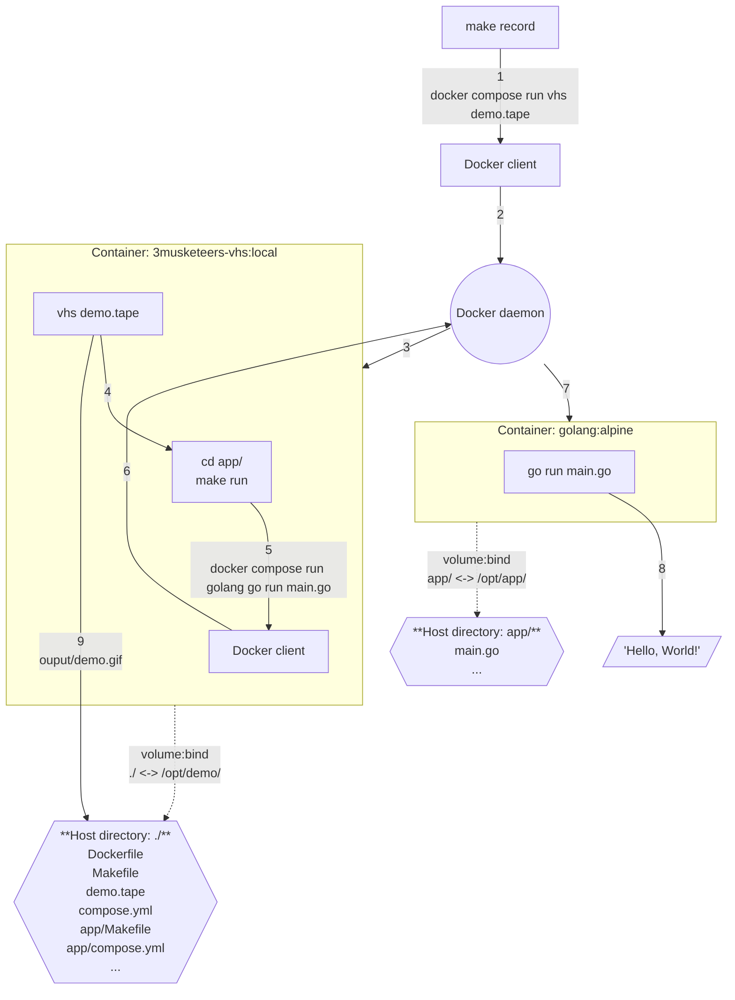

# Demo

This is self-content code to generate the 3 Musketeers demo with [charmbracelet/vhs](https://github.com/charmbracelet/vhs).


## Prerequisites

- [Docker](https://www.docker.com/)
- [Compose](https://docs.docker.com/compose/)
- [Make](https://www.gnu.org/software/make/)
- [GitHub account](https://github.com/)
- [GitHub fine-grained personal access token](https://docs.github.com/en/authentication/keeping-your-account-and-data-secure/managing-your-personal-access-tokens#fine-grained-personal-access-tokens)
	- Token access
		- Only select repositories
		- Contents: Read and Write
		- Metadata: Read-only

## Usage

```bash
# Create a .env file and modify it with the correct values
# All variables are required but does not mean they are all used at once
make envfile
# Build dependencies such as the Docker image
make deps
# Test the code
make test
# Record the demo
make record
# Publish the demo to its own orphan branch
make publish
# Clean up
make prune
```

## Implementation



Flow:

1. `make record` sends the command `docker compose run vhs demo.tape` with the Docker client.
2. The Docker client sends it to the Docker daemon.
3. The Docker daemon creates a service `vhs`.
	- The details of the service is defined in `compose.yml`.
	- The container is based on Docker image `flemay/3musketeers-vhs:local`.
	- The image `flemay/3musketeers-vhs:local` definition comes from `Dockerfile`. It is based on `ghcr.io/charmbracelet/vhs` and adds required tools for the demo such as: `nvim`, `make`, `docker`, and `compose`.
	- A volume is created which maps the host directory `./` to container directory `/opt/demo/`. This makes the file `demo.tape` accessible to `vhs` inside the container.
	- `vhs demo.tape` is then executed.
4. `vhs demo.tape` calls the commands `cd app/` and `make run`.
5. `make run` executes the command `docker compose golang go run main.go` with the Docker client (inside the container).
6. The Docker client (inside the container) passes the command to Docker daemon (on the host).
	- This is possible because the service `vhs` (defined in `compose.yml`) mounts the host `/var/run/docker.sock`.
7. The Docker daemon creates a service `golang`.
	- The container is based on the official Go Docker image.
	- The details of the service is in `app/compose.yml`.
	- The service `golang` defines a volume that maps the host directory `app/` to the container directory `/opt/app/`. That directory contains the source file `main.go`.
		- It is important to note that the full path to the host directory `app/` is passed to the service (using environment variable `ENV_HOST_APP`) and not the container path `/opt/demo/app/` even if the command originated from the container `vhs`. This is because the Docker daemon (being outside of the container) would not know the location of `/opt/demo/app/`.
		- The variable substitution `${ENV_HOST_APP_DIR:-.}` sets the `source` to the value of the environment variable `ENV_HOST_APP_DIR`. If not present, it sets it to `.` which means current directory. This allows the Go application example to work with and without Docker-outside-of-Docker (DooD).
	- `go run main.go` is executed inside the container.
8. `Hello, World!` is printed out.
9. `vhs` saves the record `demo.gif` into directory `/opt/demo/output/` which is also accessible from the host directory `./output/`.

## References

- [VHS](https://github.com/charmbracelet/vhs)
- [Docker](https://www.docker.com/)
- [Compose](https://docs.docker.com/compose/)
- [Make](https://www.gnu.org/software/make/)
- [ShellCheck](https://www.shellcheck.net/)
- [Mermaid](https://mermaid.js.org/)
- [VHS Themes](https://github.com/flemay/vhs-themes)
- [GitHub](https://github.com/)
- [Storing Images and Demos in your Repo](https://gist.github.com/joncardasis/e6494afd538a400722545163eb2e1fa5)

