# 3 Musketeers

 

## What

The 3 Musketeers is a pattern for developing software in a repeatable and consistent manner. It leverages Make as an orchestration tool to test, build, run, and deploy applications using Docker and Docker Compose. The Make and Docker/Compose commands for each application are maintained as part of the application’s source code and are invoked in the same way whether run locally or on a CI/CD server.

## Why

### Consistency

Run the same commands no matter where you are: Linux, MacOS, Windows, CI/CD tools that supports Docker like GitHub Actions, Travis CI, CircleCI, and GitLab CI.

### Control

Take control of languages, versions, and tools you need, and version source control your pipelines with your preferred VCS like GitHub and GitLab

### Confidence

Test your code and pipelines locally before your CI/CD tool runs it. Feel confident that if it works locally, it will work in your CI/CD server.

---

::: info
The 3 Musketeers is not affiliated with Docker, Inc. or Docker Project in any way. The logo has been inspired by existing drawings on the Internet.
:::

::: warning OPINIONATED
This website contains opinionated guidelines and tips based on our experience using the 3 Musketeers and are subject to change over time. Feel free to use/share your own guidelines, or even [contribute][linkContributing].
:::

[linkContributing]: contributing
