# Patterns

In a nutshell, Make calls either Docker or Compose which then runs a Command inside a container. A project does not need to follow only 1 pattern. For instance, `make targetA` can call Compose and `make targetB`, Docker.



> [!NOTE]
> The code in this section is expected to be fully functional.

> [!TIP]
> The [3 Musketeers repository][link3MusketeersGitHub] applies the patterns:
>
> - Compose: [this website development][link3MusketeersWebsiteDevelopment]
> - Docker: section [Getting started][link3MusketeersGettingStarted]
> - Docker-outside-of-Docker: [demo generated with VHS][link3MusketeersDemoCode]

## Compose

In this pattern, Make calls Compose which then runs the Command inside a container.


### Examples

Here are some examples illustrating Compose with different commands.

#### Make

Make calls Compose which then calls another Make target inside a Docker container. This requires the Docker image (that runs the command) to have Make installed.

> [!TIP]
> There are [ways][linkDocker] to add Make to your Docker image if it does not have it.

```yaml
# compose.yml
version: '3'
services:
  alpine:
    image: alpine
    volumes:
      - .:/opt/app
    working_dir: /opt/app
```

```make
# Makefile
echo:
	docker compose run --rm alpine make _echo

_echo:
	echo 'Hello, World!'
```

```bash
make echo
```

#### Shell

Make calls Compose which executes a shell/bash command inside a Docker container.

```yaml
# compose.yml
version: '3'
services:
  alpine:
    image: alpine
```

```make
# Makefile
echo:
	docker compose run --rm alpine sh -c 'echo Hello, World!'
```

```bash
make echo
```

#### Shell file

Make calls Compose which executes a shell/bash command inside a Docker container. The following example uses a shell file that mimics Make:

```bash
# make.sh
#!/usr/bin/env sh
deps(){
  printf "deps\n"
}

test(){
  printf "test\n"
}

for target in "$@"
do
  case "$target" in
    (deps)
      deps
      ;;
    (test)
      test
      ;;
    (*)
      printf "Usage: $0 {deps|test}\n"
      exit 2
      ;;
  esac
done
```

```bash
# set executable permission
chmod +x make.sh
```

```yaml
# compose.yml
version: '3.8'
services:
  alpine:
    image: alpine
    volumes:
      - .:/opt/app
    working_dir: /opt/app
```

```make
# Makefile
test:
	docker compose run --rm alpine make.sh deps test
```

```bash
make test
```

#### Go

Languages like Go, Python, JavaScript, Ruby, etc can be used as an alternative to shell/bash scripts. The following example uses Go to echo 'Hello, World!'.

```go
// main.go
package main

import "fmt"

func main() {
	fmt.Println("Hello, World!")
}
```

```yaml
# compose.yml
version: '3'
services:
  golang:
    image: golang:alpine
    volumes:
      - .:/opt/app
    working_dir: /opt/app
```

```make
# Makefile
echo:
	docker compose run --rm golang go run main.go
```

```bash
make echo
```

#### npm

There are many languages and tools out there to make task implementation easy such as Gulp and Rake. Those tools can easily be integrated to the 3 Musketeers. The following is simply a NodeJS example which echos "Hello, World!" by invoking npm.

```json
// package.json
{
  "name": "helloworld",
  "description": "echos 'Hello, World!'",
  "scripts": {
    "echo": "echo 'Hello, World!'"
  }
}
```

```yaml
# compose.yml
version: '3'
services:
  node:
    image: node:alpine
    volumes:
      - .:/opt/app
    working_dir: /opt/app
```

```make
# Makefile
echo:
	docker compose run --rm node npm run echo
```

```bash
make echo
```

## Docker

Make calls directly Docker instead of Compose. Everything that is done with Compose can be done with Docker. Using Compose helps to keep the Makefile clean.


```make
# Makefile
echo:
	docker run --rm alpine echo 'Hello, World!'
```

```bash
make echo
```

## Docker-in/outside-of-Docker (DinD/DooD)

There are many articles and videos talking about Docker-in-Docker (DinD) and Docker-outside-of-Docker (DooD) with pros and cons. This section describes a pattern that can be applied to both. A Docker container contains Make, Docker, and Compose which communicates to a Docker daemon, whether it is on a host (DooD) or inside another container (DinD). In such case, an image like [flemay/musketeers][linkMusketeersImage] can be used.



An example of DooD is the [3 Musketeers demo generated with VHS][link3MusketeersDemoCode].

Another example is GitLab CI which allows [access to Docker daemon within a Docker container][linkGitLabDinD]. A pipeline configuration would look like the following:

```yaml
# .gitlab-ci.yml
image: flemay/musketeers:latest
services:
  - docker:dind
variables:
  DOCKER_HOST: "tcp://docker:2375"

stages:
  - test

test:
  stage: test
  script:
    - make test
```

Some references:

- Jérôme Petazzoni's excellent [blog post][linkDinD] on using Docker-in-Docker outlines some of the pros and cons of doing so (and some nasty gotchas you might run into).
- [Docker-in-Docker: Containerized CI Workflows (DockerCon 2023)][linkDinDDockerCon]


[link3MusketeersDemoCode]: https://github.com/flemay/3musketeers/tree/main/demo
[link3MusketeersGettingStarted]: https://github.com/flemay/3musketeers?tab=readme-ov-file#getting-started
[link3MusketeersGitHub]: https://github.com/flemay/3musketeers
[link3MusketeersWebsiteDevelopment]: https://github.com/flemay/3musketeers?tab=readme-ov-file#3-musketeers-website-development
[linkDinDDockerCon]: https://www.youtube.com/watch?v=JyEwKm-OfxA
[linkDinD]: https://jpetazzo.github.io/2015/09/03/do-not-use-docker-in-docker-for-ci/
[linkDocker]: docker
[linkGitLabDinD]: https://docs.gitlab.com/ee/ci/docker/using_docker_build.html
[linkMusketeersImage]: https://cloud.docker.com/u/flemay/repository/docker/flemay/musketeers
