import { Steps } from '@astrojs/starlight/components'; import { FileTree } from
'@astrojs/starlight/components';

Let's print out `Hello, World!` in the terminal using the 3 Musketeers. The
command `make echo` will be calling Docker to run the command
`echo 'Hello, World!'` inside a container.



## Prerequisites

- [Docker][linkDocker]
- [Compose][linkCompose]
- [Make](https://www.gnu.org/software/make/)

## Steps

<Steps>

1. Overview of final folder

   <FileTree>
   - hello-world
     - compose.yml
     - Makefile

   </FileTree>

1. Create file `compose.yml`

   ```yaml title="compose.yml"
   services:
     alpine:
       image: alpine
   ```

1. Create file `Makefile`

   ```make title="Makefile"
   echo:
    docker compose run --rm alpine echo 'Hello, World!'
   ```

1. Run the command

   ```bash
   make echo
   ```

</Steps>

[linkDocker]: https://docs.docker.com/engine/installation/
[linkCompose]: https://docs.docker.com/compose/install/
