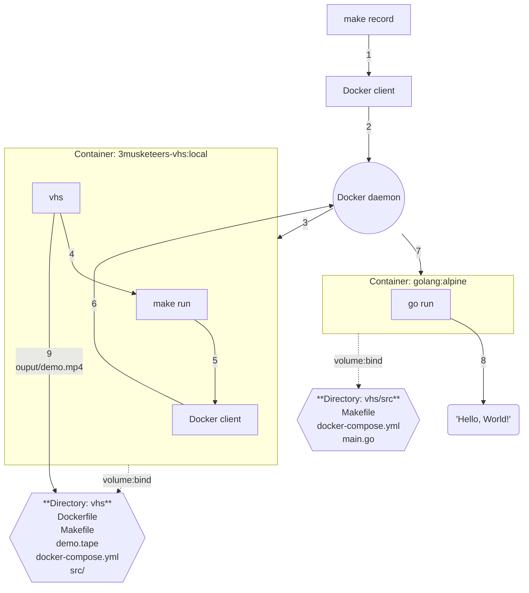

# VHS - Demo

This is self-content code to generate the 3 Musketeers demo with [charmbracelet/vhs](https://github.com/charmbracelet/vhs).

## Prerequisites

- [Docker](https://www.docker.com/)
- [Compose](https://docs.docker.com/compose/)
- [Make](https://www.gnu.org/software/make/)

## Usage

```bash
# Build dependencies such as the Docker image
make deps
# Record the demo
make record
# Clean up
make prune
```

## Implementation



## References

- [VHS](https://github.com/charmbracelet/vhs)
- [Docker](https://www.docker.com/)
- [Compose](https://docs.docker.com/compose/)
- [Make](https://www.gnu.org/software/make/)
- [VHS Themes](https://github.com/flemay/vhs-themes)
