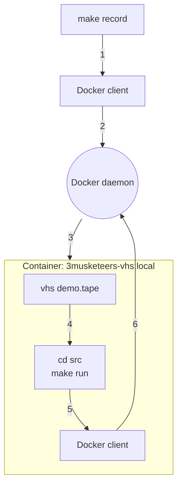

# VHS - Demo

This is self-content code to generate the 3 Musketeers demo with [charmbracelet/vhs](https://github.com/charmbracelet/vhs).

## Prerequisites

- [Docker](https://www.docker.com/)
- [Compose](https://docs.docker.com/compose/)
- [Make](https://www.gnu.org/software/make/)

## Usage

```bash
# Build dependencies such as the Docker image
make deps
# Record the demo
make record
# Clean up
make prune
```

## Implementation



Flow:

1. `make record` calls the command `docker compose` with the Docker client
2. The Docker client sends the command to the Docker daemon on the host
3. The Docker daemon creates a new service based on Docker image `flemay/3musketeers-vhs:local`
	1. The details of the service is defined in `docker-compose.yml`
	1. The image `flemay/3musketeers-vhs:local` definition comes from `Dockerfile`. It is based on `ghcr.io/charmbracelet/vhs` and adds required tools for the demo such as: `nvim`, `make`, `docker`, and `compose`.
	1. A volume is created which maps the host directory `src` to container directory `/opt/src`. This makes the file `demo.tape` accessible to `vhs` inside the container.
	1. `vhs demo.tape` is then executed
4. `vhs demo.tape` calls the commands `cd src/` and `make run`
5. `make run` executes the command `docker compose golang go run main.go` with the Docker client (inside the container)
6. The Docker client (inside the container) passes the command to Docker daemon (on the host)
	1. This is possible because the service `vhs` (defined in `docker-compose.yml`) mounts the host `/var/run/docker.sock`
7. The Docker daemon creates a new service (container) `golang` based on the official Go Docker image
	1. The details of the service is in `src/docker-compose.yml`
	1. The service `golang` defines a volume that maps the host directory `vhs/src` to the container. That directory contains the source file `main.go`.
	1. It is important to note that creating a volumes that is
8.
9.

## References

- [VHS](https://github.com/charmbracelet/vhs)
- [Docker](https://www.docker.com/)
- [Compose](https://docs.docker.com/compose/)
- [Make](https://www.gnu.org/software/make/)
- [VHS Themes](https://github.com/flemay/vhs-themes)
